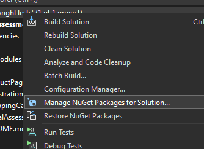
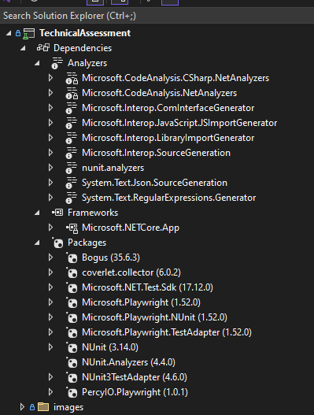
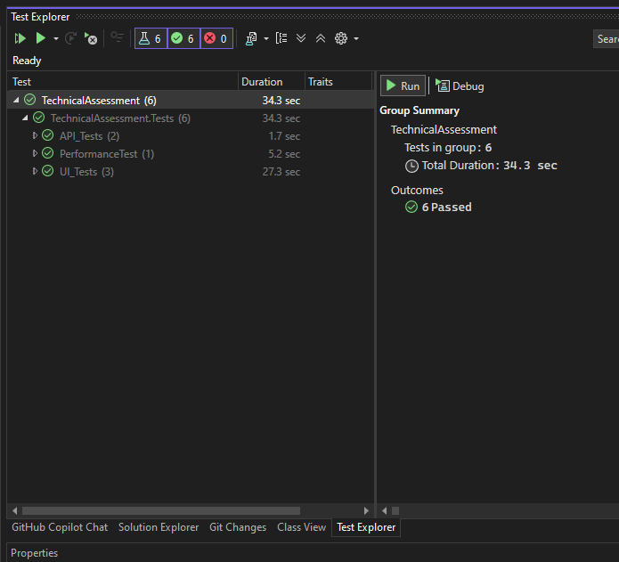
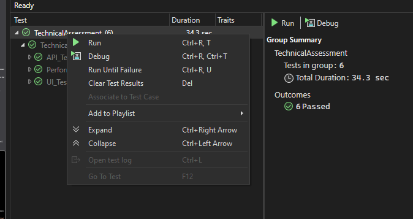
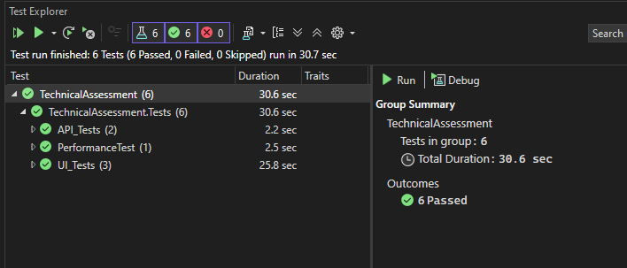
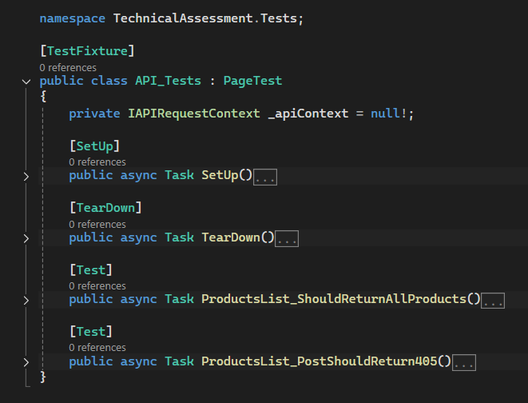
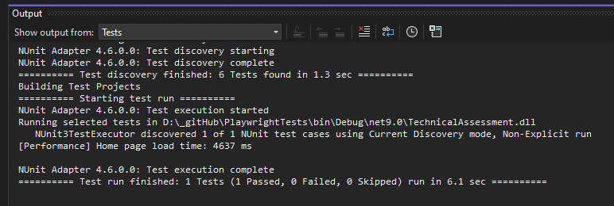

## Originality Statement

I can confirm that this project, **PlaywrightTests**, for **Technical Assessment for  Northumbria Hospital Trust**, is my original work. Nobody or noone helped me in creating this project and all the source code in it. 

I have been using the following resources to help me with this project:
1. [Playwright for .NET][Source1]
2. [.NET Documentation][Source2]
3. [Automation Exercise website][Source3]
4. [StackOverflow][Source4]
5. [Percy website for Visual Regression Testing][Source5]
6. [Reddit Technology Section][Source6]
7. [Medium][Source7]
8. [GitHub for Bogus][Source8]
9. [nuget website][Source9]
10. [Playwright with C# .NET Tutorial on YouTube][Source10]
11. [Performance Testing using Playwright on YouTube][Source11]
12. [Measuring Page Performance Using Playwright - Best Practices][Source12]

[Source1]: https://playwright.dev/dotnet/docs/intro
[Source2]: https://learn.microsoft.com/en-us/dotnet/
[Source3]: https://automationexercise.com/
[Source4]: https://stackoverflow.com/
[Source5]: https://percy.io/
[Source6]: https://www.reddit.com/r/technology/
[Source7]: https://medium.com/
[Source8]: https://github.com/bchavez/Bogus
[Source9]: https://www.nuget.org/
[Source10]: https://www.youtube.com/watch?v=5i53YLWD_QI&list=PL6tu16kXT9PoUv6HwexX5LPBzzv7QkI9W
[Source11]: https://www.youtube.com/watch?v=IrK-XDH72bw
[Source12]: https://www.checklyhq.com/learn/playwright/performance/

## Setp Instructions

For the setup instruction, I followed [Installation][Source13] documentation to a T using NUnit as the instructions. I setup the test using [Microsoft Visual Studio 2022 Community Edition][Source14] which I downloaded and installed for this technical assessment.

For dependencies, I install and use from **NuGet Packages Manager** on Visual Studio.

<figure>
	<figcaption>NuGet Packages</figcaption>
	
</figure>

The list of all dependencies can be referred to by this screenshot below:

<figure>
	<figcaption>Complete Dependencies</figcaption>
	
</figure>

[Source13]: https://playwright.dev/dotnet/docs/intro
[Source14]: https://visualstudio.microsoft.com/downloads/

### Test Execution Commands

For test execution, I open the Test Explorer section and start running the tests.

<figure>
	<figcaption>Figure 1: Test Explorer</figcaption>
	
</figure>

<figure>
	<figcaption>Figure 2: Run Link</figcaption>
	
</figure>

<figure>
	<figcaption>Figure 3: Test Result</figcaption>
	
</figure>

## Architecture and Pattern

The test architecture for this technical assignment is **Unit and Integration Testing Architecture**. As such, I follow the **Page Object Model** because I believe that this pattern gives more organised way to maintain test code by encapsulating the elements of [the web page][Source15]. Also, in this technical assessment, I include **API** and **Performance Testings**

[Source15]: https://automationexercise.com

### Key Decisions

At first, I manually tested all the requirements for 3 scenarios. Then, I wrote the automation test scripts and separate them into 3 tests, namely:

A_UserRegistrationFlow  
B_ProductSearchAndFiltering  
C_ShoppingCartFunctionality  

When I was creating **SetUp()**, I managed to get a visual regression testing done. This is for fuuture reference if more work needs to be done. For this, I signed up with Percy website and I approved the screenshot on my Percy dashboard. The screenshot can be found in my local repository with the following address:

[Location of the file: logo.png](file:///D:/_gitHub/PlaywrightTests/bin/Debug/net9.0/)

After this, I applied **Page Object Model** pattern and I created new folder called **Pages** where I place the followings:

(1) ProductPage.cs  
(2) RegistrationPage.cs  
(3) ShoppingCartPage.cs  

Also, I created a **Utility** folder, at the same time when I was doing **POM**, where I created the followings:

(1) TestData.cs  
(2) TestLocator.cs  
(3) TestMessages.cs  

Then, I created API Test containing basic **GET** and **POST** requests.

<figure>
	<figcaption>API Test</figcaption>
	
</figure>

For API Test, I managed to make the JOSN file pretty in the documentation.

[Location of the file: productList_pretty.json](file:///D:/_gitHub/PlaywrightTests/bin/Debug/net9.0/)

After I have done with API Test, I moved on to create **Performance Test**. The result of the Performance Test is in the Ouput section as shown below.

<figure>
	<figcaption>Performance Test Result</figcaption>
	
</figure>

I had a look at different pattern, namely **Screenplay Pattern**, but at this time, the pattern can be implemented on later stage where:

• The automation code is becoming too massive  
• The test architecture is changing to **Acceptance Testing Architecture**  
• The AUT (Application Under Test) focuses on performing _tasks_ and _interactions_.  
• The AUT is frequently changing.  
• The Management wants QA Team to write more expressive and closer to business language.  

With those facts in mind, I am aware of the **Screenplay Pattern**, but at this stage, I am implementing **Page Object Model**.

I am also aware of the **Data-Driven Testing**, but I do not implement this for this technical assessment. The reasons why are as follows:

• This technical assessment focuses on behaviour, not data variations.  
• The complexity and overhead outweighs the benefits since this technical assessment is more about workflow correctness.  
• Data-Driven Testing makes test cases less expressive about _why_ a scenario is tested because the focus is on the data.  
• Data-Driven Testing requires high maintenance to keep input data stable.

With these facts in mind, I am aware of the **Data-Driven Testing, but at this stage, I am not implementing this **Data-Driven Testing**.

### Challenges

The biggest challenge is to get to know Microsoft Visual Studio 2022 Community Edition. The layout and the shortcuts, not to mention anything else, are different and I had to learn them since the start of writing the technical assessment. How to solve this challenge? I googled a lot.

The other challenge, albeit mini, is to brush up on my C# language. How to solve this challenge? I googled a lot as well. 

One website that helped me a lot is [StackOverflow][Source4].

### Future Improvement

The time given to do this technical assessment is quite generous. Coupled with my own personal life, I find the time is to be very understanding. The future improvement for this test automation really depends on the feedback from Project Manager, Developers, fellow QAs and business users. Without their feedback, it is only a game of guessing which area of automation can be improved. It is not about the time, rather it is more about the feedback from the team and from the business users. Also, the framework can be improved or changed depends on the feedback and/or the business needs. Once you understand what needs to be done, the rest is just about doing it. Because ... Google is always by your side. :smile:

However, on second thought, looking back at the TestData.cs, TestLocator.cs and TestMessages.cs, if I am given more time, I will clean up these files and make them more manageable. I will try to organise them in alphabetical order, or any sort of logical way. Because, where I used to work before, the files in Utility folder were messy and not easy to understand. The contents were all over the place. People just dump whatever they can think of without thinking about the order. They are becoming very massive and unmanageable. As such, rather than searching for an existing locator, for example, people just create a new one. Imagine of more than 10 QAs working on the same repository. :s
